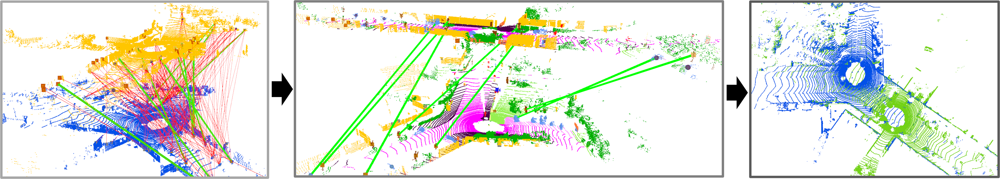

复现

1. scorePairwiseConsistencyGaussian 允许相同匹配
2. 度量
3. trunk的索引bug
4. 问题不在前端
5. 随机初始化X
6. 图的建立不一样X

# ***Segregator***: Global Point Cloud Registration with Semantic and Geometric Cues

**Pengyu Yin**, **Shenghai Yuan**, **[Haozhi Cao](https://www.researchgate.net/profile/Haozhi-Cao)**, **Xingyu Ji**, *
*Shuyang Zhang**, and **[Lihua Xie](https://dr.ntu.edu.sg/cris/rp/rp00784)**

[preprint on Arxiv](https://arxiv.org/abs/2301.07425)



Segregator is a global point cloud registration pipeline using both semantic and geometric information. Instead of
focusing solely on point level features, we build degenerancy-robust correspondences between two LiDAR scans on a
mixed-level (geometric features as well as semantic clusters). Additionally, G-TRIM based outlier pruning is also
proposed to find out the inlier correspondence set more efficiently. Please refer to our paper for more details.

----

### Test Environment

* Linux 18.04/20.04 LTS
* ROS Melodic/Noetic

----

### Installation

Run the following lines for denpandencies:

```
sudo apt install cmake libeigen3-dev libboost-all-dev
```

Use [catkin_tools](https://catkin-tools.readthedocs.io/en/latest/) to build the project:

```
mkdir -p ~/catkin_ws/src
cd ~/catkin_ws/src/global_registration
git clone git@github.com:Pamphlett/Segreagator.git
cd Segreagator && mkdir build && cd build
cmake ..
mv pmc-src/ ../../../../build/
cd ~/catkin_ws
catkin build segregator 
```

----

### Test on different datasets

* #### Toy example on KITTI

We include two distant scans (frame 0 and 4413), as well as their corresponding semantic masks,
from [KITTI](https://www.cvlibs.net/datasets/kitti/) dataset sequence 00. Please run the following lines in the catkin
workspace to reproduce the figure above:

```
source devel/setup.bash
roslaunch segregator run_segregator.launch
```

* #### On other/self-collected dataset

Generally, apart from the pointcloud file itself, per-point semantic label is also needed to make Segregator work. We
recommend using [SPVNAS](https://github.com/mit-han-lab/spvnas/blob/master/README.md#news) (the most
accurate), [Rangenet](https://github.com/PRBonn/rangenet_lib)
or [SalsaNext](https://github.com/TiagoCortinhal/SalsaNext) (far more computationally efficient, range image-based
methods with a bit segmentation quality drop) to generate these labels.

----

### Comparative Results

TO BE ADDED

### Citation

If you find Segregator useful in your academic project, please cite our paper:

```
@article{yin2023segregator,
  title={Segregator: Global Point Cloud Registration with Semantic and Geometric Cues},
  author={Yin, Pengyu and Yuan, Shenghai and Cao, Haozhi and Ji, Xingyu and Zhang, Shuyang and Xie, Lihua},
  journal={arXiv preprint arXiv:2301.07425},
  year={2023}
}
```

### Contact

Please kindly reach out to me if you have any question. Any discussion is also welcome:
Pengyu Yin ([pengyu001@ntu.edu.sg]())

### Acknowledgements

This research is supported by the National Research Foundation, Singapore under its Medium Sized Center for Advanced
Robotics Technology Innovation ([CARTIN](https://www.ntu.edu.sg/cartin)).

Also, we would like to show our greatest thankfulness to authors of the following repos for making their works public:

* [Teaser](https://github.com/MIT-SPARK/TEASER-plusplus) (baseline)
* [Quatro](https://github.com/url-kaist/Quatro) (baseline)
* [SPVNAS](https://github.com/mit-han-lab/spvnas) (semantic segmentation)
* [T-LOAM](https://github.com/zpw6106/tloam) (clustering) 
